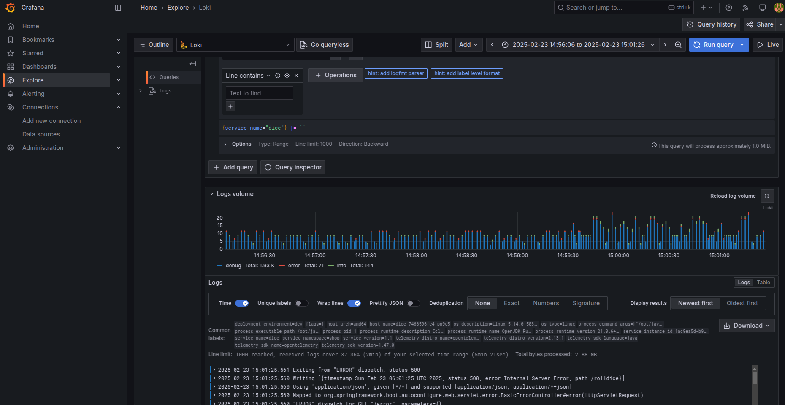
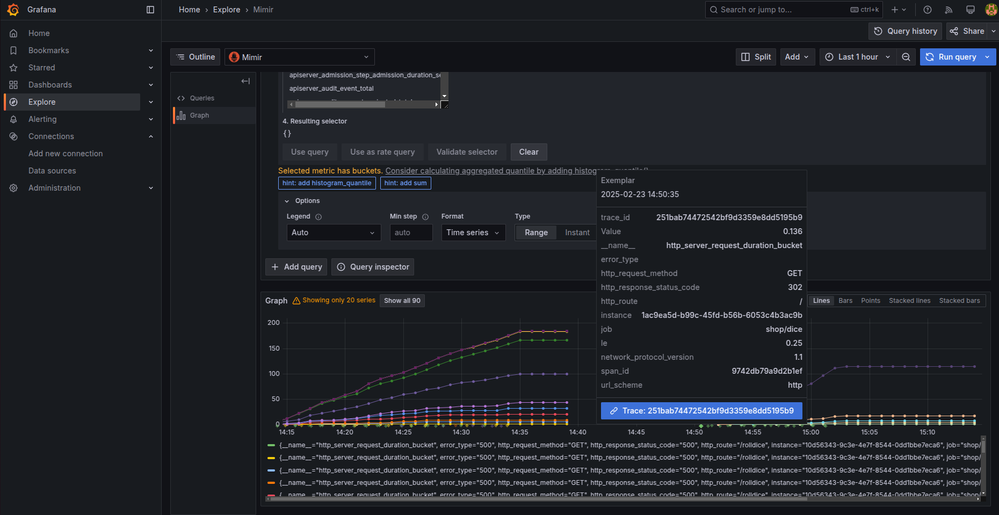
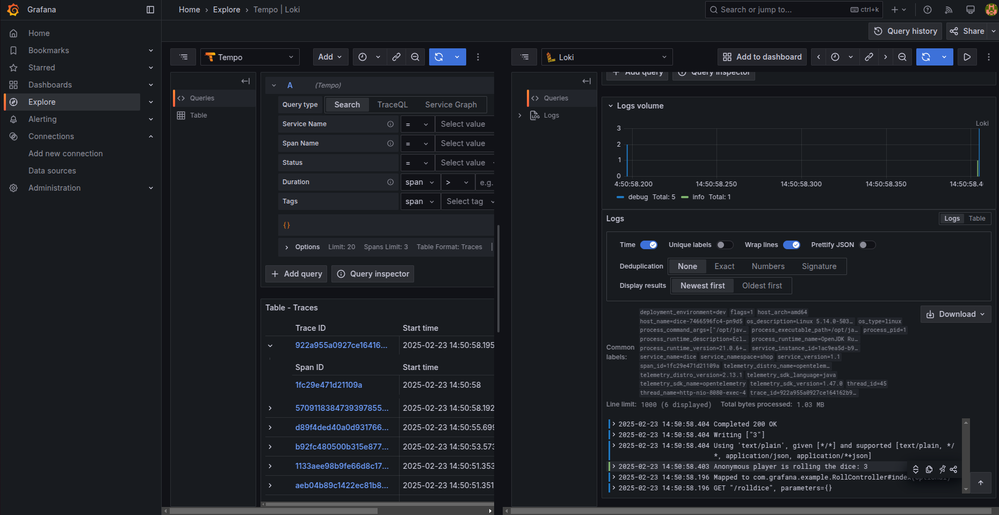
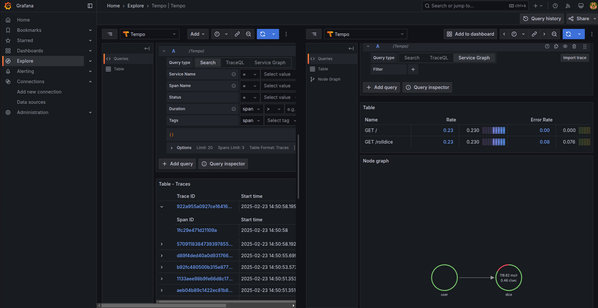

# kube-monitoring-stack

```
- 오픈텔레메트리 콜렉터를 이용하여 트레이스, 메트릭, 로그를 통합 수집
- trace id를 통해 각 정보를 입체적으로 연계하여 확인
- 오픈텔레메트리 에이전트는 오퍼레이터를 통해 애플리케이션에 자동 주입되고
- 애플리케이션 정보는 Mimir, Loki, Tempo에 저장
- 각 저장소는 확장 chart가능하도록 minio s3 백엔드로 구성
```






---
#### 1) 프로메테우스 메트릭 - Mimir 저장 환경

- 프로메테우스 helm charts의 kube-state-metric, node-exporter와 기본 수집 메트릭 설정 적용
- prometheus install (node-exporter, state-metrics, mimir remote push 설정)
- mimir 설치, 프로메테우스 push 설정
- mimir charts 내 minio을 이용한 bucket 생성
- mimir config exemplar 설정 추가 : structuredConfig
   ```
   # prometheus.yaml
   remoteWrite:
     - url: http://mimir-nginx.monitoring.svc:80/api/v1/push

    mimir-distributed:
      mimir:
        structuredConfig:
          limits:
            max_cache_freshness: 10m
            max_query_parallelism: 240
            max_total_query_length: 12000h
            max_global_exemplars_per_user: 100000 # enable exemplar
   ```
- grafana install (메트릭 확인용)
   ```
   # grafana datasource
   datasources:
  datasources.yaml:
    apiVersion: 1
    datasources:
    - name: Prometheus
      type: prometheus
      url: http://prometheus-server.monitoring:80      
      isDefault: true
      editable: true
    - name: Mimir
      type: prometheus
      url: http://mimir-nginx.monitoring.svc:80/prometheus
      editable: true
    ```
--- 
#### 2) 클러스터 모니터링 대시보드 
- 클러스터 정보 : 버전, 노드 수 , CPU, 메모리, 디스크, 평균 사용량
- 네임스페이스 수, 목록, 디플로이먼트, 스테이트풀셋, 데몬셋 정보
- 서비스, Ingress 정보
  ```
  # https://github.com/dotdc/grafana-dashboards-kubernetes
  dashboards:
    default:
      k8s_global:
        gnetId: 15757
        revision: 1
        datasource: Mimir
      k8s_nodes:
        gnetId: 15759
        revision: 1
        datasource: Mimir  
      k8s_namespaces:
        gnetId: 15758
        revision: 1
        datasource: Mimir
      k8s_pods:
        gnetId: 15760
        revision: 1
        datasource: Mimir
  ```
=======
- https://github.com/dotdc/grafana-dashboards-kubernetes
---
#### 3) Opentelemetry Collector - Mimir 메트릭 수집 구성
- Opentelemetry를 이용한 메트릭 수집 설정
  - Opentelemtry Connector helm chart 추가 (chats/opentelemetry-collector)
  - Mimir 엔드포인트 설정
  ```
  config:
    exporters:
      debug:
        verbosity: detailed
      otlphttp:
        endpoint: http://k8s-monitoring-mimir-nginx.monitoring.svc:80/otlp
  ```
  - OTLP receiver 설정

#### 4) Loki, Tempo 저장소 구성
  - loki 추가 - loki-simple-scalable
  - mimir-distributed/minio bucket create 추가 (mimir 서브차트로 설정)
  ```
  loki:
    nameOverride: "k8s-monitoring-loki"
    deploymentMode: SimpleScalable
    loki:
      auth_enabled: false
      useTestSchema: true
      storage:
        bucketNames:
          chunks: chunks
          ruler: ruler
          admin: admin
        type: s3
        s3:
          s3ForcePathStyle: true
          insecure: true
  backend:
    replicas: 1
  read:
    replicas: 1
  write :
    replicas: 3    # write 파드는 3개 클러스터 필수
  chunkCache:
    enabled: false # 자원 최소화 시 false


  ```
#### 5) Tempo를 통한 traces 정보 수집
  - temp chart 추가 : temp chart
  - metric generation > mimir 로 저장
  - s3 bucket tempo-store에 데이터 저장
  ```
  tempo:
    nameOverride: "k8s-monitoring-tempo"
    tempo:
      metricsGenerator:
        enabled: true
        remoteWriteUrl: "http://k8s-monitoring-mimir-nginx.monitoring.svc:80/api/v1/push"
      storage:
        trace:
          backend: s3
          s3:
            bucket: tempo-store   
            endpoint: "k8s-monitoring-minio:9000"  # http:// 제외해야 정상 동작
            access_key: console 
            secret_key: console123
            insecure: true
            forcepathstyle: true       
  ```
#### 6) 그라파나 Datassource 설정
    - loki: http://k8s-monitoring-loki-distributed-gateway
    - tempo: http://k8s-monitoring-k8s-monitoring-tempo:3100
    - mimir: http://k8s-monitoring-mimir-nginx.monitoring.svc:80/prometheus
    - prometheus: http://k8s-monitoring-prometheus-server.monitoring:80
  
#### 7) Trace ID - Exemplar 연동 구성
  ```
  # Tempo Metric Generator 설정
      overrides:
        metrics_generator_processors:
          - 'service-graphs'
          - 'local-blocks'
          - 'span-metrics'
      metrics_generator:
        processor:
          local_blocks:
            filter_server_spans: false
          span_metrics:
            dimensions:
              - service_name
              - operation
              - status_code
        traces_storage:
          path: /tmp/tempo/generator/traces
        storage:
          path: "/tmp/tempo/generator/wal"
          remote_write:
            - url: $mimir endpoint
                  send_exemplars: true

  # 그라파나 추가 데이터 연동 설정
      datasources:
      - name: Mimir
        jsonData:
          timeInterval: 60s
          exemplarTraceIdDestinations:
            - name: trace_id
              datasourceUid: tempo
              urlDisplayLabel: "Trace: $${__value.raw}"
      - name: Loki
        jsonData:
          derivedFields:
            - name: "trace_id"
              matcherType: "label"
              matcherRegex: "trace_id"
              url: "$${__value.raw}"
              datasourceUid: "tempo"
              urlDisplayLabel: "Trace: $${__value.raw}"
      - name: Tempo
        jsonData:
          tracesToLogsV2:
            customQuery: true
            datasourceUid: "loki"
            query: '{$${__tags}} | trace_id = "$${__trace.traceId}"'
            tags:
              - key: "service.name"
                value: "service_name"
          serviceMap:
            datasourceUid: "mimir"
          search:
            hide: false
          nodeGraph:
            enabled: true
          lokiSearch:
            datasourceUid: "loki"
  ```


  - Opentelemetry Connector와 연동 구성

  ```
    opentelemetry-collector:
      mode: "deployment"
      presets:
        kubernetesEvents:
          enabled: true
      config:
        exporters:
          debug:
            verbosity: detailed
          otlphttp:
            endpoint: http://k8s-monitoring-mimir-nginx.monitoring.svc:80/otlp
          otlphttp/loki:
            endpoint: http://k8s-monitoring-k8s-monitoring-loki-gateway.monitoring.svc:80/otlp
          otlphttp/traces:
            endpoint: http://k8s-monitoring-k8s-monitoring-tempo.monitoring.svc:4318
        processors:
          batch: {}
          memory_limiter:
            check_interval: 5s
            limit_percentage: 80
            spike_limit_percentage: 25
        receivers:
          otlp:
            protocols:
              grpc:
                endpoint: ${env:MY_POD_IP}:4317
              http:
                endpoint: ${env:MY_POD_IP}:4318
          prometheus:
            config:
              scrape_configs:
                - job_name: opentelemetry-collector
                  scrape_interval: 10s
                  static_configs:
                    - targets:
                        - ${env:MY_POD_IP}:8888
        service:
          telemetry:
            metrics:
              address: ${env:MY_POD_IP}:8888
          extensions:
            - health_check
          pipelines:
            logs:
              exporters:
                - debug
                - otlphttp/loki
              processors:
                - memory_limiter
                - batch
              receivers:
                - otlp
            metrics:
              exporters:
                - debug
                - otlphttp
              processors:
                - memory_limiter
                - batch
              receivers:
                - otlp
                - prometheus
            traces:
              exporters:
                - debug
                - otlphttp/traces
              processors:
                - memory_limiter
                - batch
              receivers:
                - otlp

      image:
       repository: "otel/opentelemetry-collector-k8s"
    ```

    
